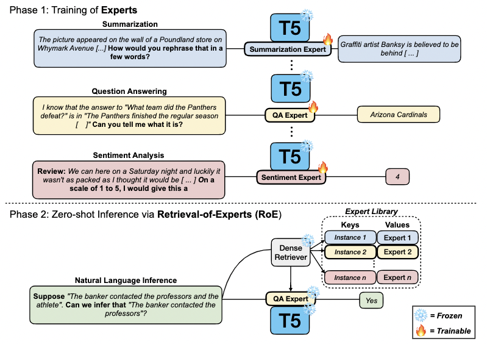
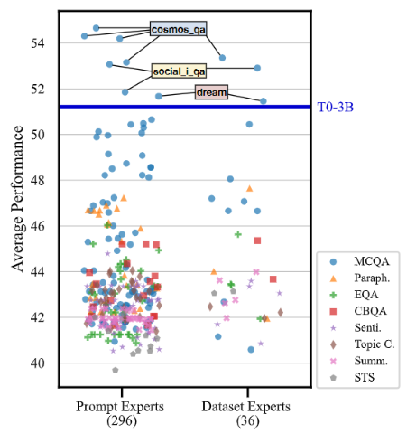

# Expert Language Models (ELM)
This is the official github repository for [Exploring the Benefits of Training Expert Language Models over Instructions Tuning](https://arxiv.org/abs/2302.03202).

Citation:
```
@article{jang2023exploring,
  title={Exploring the Benefits of Training Expert Language Models over Instruction Tuning},
  author={Jang, Joel and Kim, Seungone and Ye, Seonghyeon and Kim, Doyoung and Logeswaran, Lajanugen and Lee, Moontae and Lee, Kyungjae and Seo, Minjoon},
  journal={arXiv preprint arXiv:2302.03202},
  year={2023}
}
```

Overview of our method, Retrieval of Experts (RoE).
<p align="center">
  
</p>

*Acknowledgements*: The underlying codebase originates from Akari's [ATTEMPT](https://github.com/AkariAsai/ATTEMPT) repository and the [compacter](https://github.com/rabeehk/compacter) repository. Also, heavily utilizes the [promptsource](https://github.com/bigscience-workshop/promptsource) and the [transformer](https://github.com/huggingface/transformers) library. Huge thanks to all the contributors for these awesome repositories!! :raised_hands:

## Content

1. Installation
2. Preparing Data
3. Training
4. Evaluating
5. Retrieval
6. Evaluating with Selected Experts

## 1. Installation
First, install the correct version of pytorch with your CUDA version
```
pip install torch==1.10.1+cu113 torchvision==0.11.2+cu113 torchaudio==0.10.1+cu113 -f https://download.pytorch.org/whl/cu113/torch_stable.html
```
Second, install the required set of libraries.
```
pip install -r requirements.txt
```

Next, additionally install the following library.
```
pip install "dill<0.3.5"
pip install setuptools==59.5.0
```

Next, please run the command below to install the dependent libraries. Most of the cuda related errors will occur if you do not run the command below.

```
python setup.py develop
```

## 2. Preparing Data
First, you have to download the following zip file from azure via wget command.
```
wget https://roe.blob.core.windows.net/roe-container/addtional_data.zip
```
The file contains 6 directories in total.
First, you should move 'indexes_256', 'indexes_512', 'retrieval_data' to "RoE/retrieval".
Next, you should move 'expert_weights', 'task_vector_checkpoints' to "RoE/seq2seq".
Lastly, you should move 'manual' to "RoE/seq2seq/data".

Some of the files are not mandatory since we provide a detailed instruction of how you can obtain each component step-by-step in this README, but you can use the provided files to skip some steps below (e.g., running inference right away with the trained expert checkpoints).

To acquire the unseen_eval_full.json file within 'RoE/seq2seq/data/manual' directory, you should run the following command.
```
extract_data_subset_unseen_eval.py
```
Similarly, you can acquire the other json files with the python files that start with "extract_data_subset".

## 3. Training
First, set up your configuration file. You could check out some examples at the 'configs/experiment' directory.
Inside the directory, configuration files with '_all' suffix indicate configuration files for dataset-level experts, and the others are prompt-level experts. (Please refer to the paper to understand dataset-level experts and prompt-level experts.)

Next, please run the command below to train adapters. You could change to the configuration file you have set.
```
python3 run_seq2seq.py ../configs/experiment/cosmos_qa/cosmos_qa8.json
```
This will save a adapter expert weight under the 'seq2seq/expert_weights' directory.


Note that we provide all the expert weights within the zip file that you might have downloaded from azure.

Also, note that our code relies on old version of HuggingFace code, so we found it really tricky to set multi-gpu. While using only one GPU is okay for training PE(Prompt Expert), training DE(Dataset Expert) w/ full parameter requires at least 4 A100 GPUs. If you would like to use multi-gpu, we recommend you train with the following repository. More specifically, you could use the 'DIRECT' configuration file for training the Dataset Expert.
```
git clone https://github.com/seonghyeonye/Flipped-Learning.git
```

We also provide the experimental setting & configurations for our compositional instruction in [https://github.com/doeyoungkim/multilingual_finetune](https://github.com/doeyoungkim/multilingual_finetune)

https://github.com/doeyoungkim/multilingual_finetune
## 4. Evaluating
For evaluation, you get to use the same configuration file as with training.
This time, all the 'eval_dataset_name', 'eval_dataset_config_name' and 'eval_prompts' are used for evaluation.
DON'T FORGET TO CHECK 'txt_save_dir' from the configuration file, which decides where the evaluation results will be stored.

Please run the command below to evaluate adapters, You could change to the configuration file you have set.
```
python3 run_unseen_eval_with_json.py ../configs/experiment/cosmos_qa/cosmos_qa8.json
```

This will save txt files containing the prediction, ground truth answer and input along with the final score (based on the eval task) at the directory assigned in 'txt_save_dir'.

For evaluating on seen tasks(T0 train tasks, but eval split), you should run the following command.
```
python3 run_seen_eval_with_json.py ../configs/experiment/cosmos_qa/cosmos_qa8.json
```

For evaluting on target tasks(continual T0 generative tasks), you should run the following command.
```
python3 run_target_eval_with_json.py ../configs/experiment/cosmos_qa/cosmos_qa8.json
```

### Loading Results as Csv File
Last, you should run the command below to make a csv file based on the txt files.
```
python3 process_csv.py
```
You should write the dataset name & prompt name at the command screen and will get a csv file under the directory 'seq2seq/csv_results'.


You could also run the command below to make a csv file for dataset-level experts.
```
python3 process_csv_dataset.py
```
It's almost the same, but don't require to type in prompt name.

Then, you'll get the results like this (where cosmos_qa experts even outperform T0 in unseen tasks!)
<p align="center">
  
</p>

## 5. Retrieval
In order to get retrieval results, first go to the retrieval directory
```
cd retrieval
```
Next, make a directory called retrieval_data and get the necessary files for retrieval from notion page (meta-data section in progress report page)
```
mkdir retrieval_data
```
Next, you have to make the retrieval indexes library before being able to get the evaluate results for the selected config. Here is an example:
```
python make_index.py --config configs/ST_label_instance_top1.json
```
We already provide the processed files within the zip file you might have downloaded from azure. Just put the retrieval_data directory in "RoE/retrieval".


Now you have the index ready! With the same config, you can run to get the results.
```
python run_retrieval.py --config configs/ST_label_instance_top1.json --eval_objective "unseen"
```
You can switch the eval_objective to seen and target in order to achieve the results of adapters w/ RoE. Note that "seen" will return a txt file that specifies which expert was retrieved.


## 6. Evaluating with Selected Experts
You would want to perform evaluation with the selected experts that you got out of retrieval/run_instance_32_merge.py or retrieval/get_oracle_list.py. First move the expert mapping file into seq2seq/merge directory. Next run the following code:
```
python3 run_unseen_eval_with_json_merge.py ../configs/merge/oracle_top1.json
```
Some configs to specify
- "top_k_merge" (int):  top k experts to merge during eval
- "txt_save_dir" (str): Directory name to log output predictions & results. 
- "expert_mapping_dir" (str): The directory to load the expert merge mapping json file.

